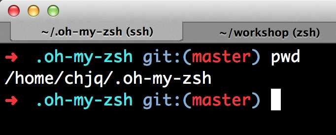

在介绍zsh前，先问两个问题吧：


1、相对于其他系统，Mac 的主要优势是什么？


2、你平时用哪种 Shell？


……

em.....Mac 的最大优势是 GUI 和命令行的完美结合，不要把所有注意力放在 Mac 性感的腰身和明媚的显示屏上好吧，如果你还在用Windows 的 cmd ，那么也没什么好聊的了。

Shell是Linux/Unix的一个外壳，你理解成衣服也行。它负责外界与Linux内核的交互，接收用户或其他应用程序的命令，然后把这些命令转化成内核能理解的语言，传给内核，内核是真正干活的，干完之后再把结果返回用户或应用程序。

Linux/Unix提供了很多种Shell，为毛要这么多Shell？难道用来炒着吃么？那我问你，你同类型的衣服怎么有那么多件？花色，质地还不一样。写程序比买衣服复杂多了，而且程序员往往负责把复杂的事情搞简单，简单的事情搞复杂。牛程序员看到不爽的Shell，就会自己重新写一套，慢慢形成了一些标准，常用的Shell有这么几种，sh、bash、csh等，想知道你的系统有几种shell，可以通过以下命令查看：

``` bash
$ cat /etc/shells
```
在 Linux 里执行这个命令和 Mac 略有不同，你会发现 Mac 多了一个 zsh，也就是说 OS X 系统预装了个 zsh，这是个神马 Shell 呢？

目前常用的 Linux 系统和 OS X 系统的默认 Shell 都是 bash，但是真正强大的 Shell 是深藏不露的 zsh， 这货绝对是马车中的跑车，跑车中的飞行车，史称『终极 Shell』，但是由于配置过于复杂，所以初期无人问津，很多人跑过来看看 zsh 的配置指南，什么都不说转身就走了。直到有一天，国外有个穷极无聊的程序员开发出了一个能够让你快速上手的zsh项目，叫做「oh my zsh」,也就是我们今天介绍的~ Github 网址是：[https://github.com/robbyrussell/oh-my-zsh](https://github.com/robbyrussell/oh-my-zsh)。这玩意就像「X天叫你学会 C++」系列，可以让你神功速成，而且是真的。

好，下面我们看看如何安装、配置和使用 zsh。

### 安装zsh
如果你用 Mac，就可以直接看下一节


如果你用 Redhat Linux，执行：

``` bash
sudo yum install zsh
```
如果你用 Ubuntu Linux，执行：


``` bash
sudo apt-get install zsh
```

如果你用 Windows……去洗洗睡吧。

安装完成后设置当前用户使用 zsh：

``` bash
chsh -s /bin/zsh
```
根据提示输入当前用户的密码就可以了。

安装oh my zsh
首先安装 git，安装方式同上，把 zsh 换成 git 即可。

安装「oh my zsh」可以自动安装也可以手动安装。

**自动安装：**
``` bash
wget https://github.com/robbyrussell/oh-my-zsh/raw/master/tools/install.sh -O - | sh
```
em.... 这里你可能会 wget:comman not found

那就不多说了，你需要安装一个

**homebrew [https://mxcl.github.io/homebrew/](https://mxcl.github.io/homebrew/)**推荐！专门来替代MacPorts
``` bash
ruby -e "$(curl -fsSkL http://raw.github.com/mxcl/homebrew/go)"
```
然后


``` bash
brew install wget
```
现在执行上面的指令，你会发现没有Windows的世界是多么美妙...

**手动安装：**

``` bash
git clone git://github.com/robbyrussell/oh-my-zsh.git ~/.oh-my-zsh
cp ~/.oh-my-zsh/templates/zshrc.zsh-template ~/.zshrc
```
都不复杂，安装完成之后退出当前会话重新打开一个终端窗口，你就可以见到这个彩色的提示了：




### 配置

zsh 的配置主要集中在用户当前目录的.zshrc里，用 vim 或你喜欢的其他编辑器打开.zshrc，在最下面会发现这么一行字：

Customize to your needs…

可以在此处定义自己的环境变量和别名，当然，oh my zsh 在安装时已经自动读取当前的环境变量并进行了设置，你可以继续追加其他环境变量。

接下来进行别名的设置，我自己的部分配置如下：


``` bash
alias cls='clear'
alias ll='ls -l'
alias la='ls -a'
alias vi='vim'
alias javac="javac -J-Dfile.encoding=utf8"
alias grep="grep --color=auto"
alias -s html=mate   # 在命令行直接输入后缀为 html 的文件名，会在 TextMate 中打开
alias -s rb=mate     # 在命令行直接输入 ruby 文件，会在 TextMate 中打开
alias -s py=vi       # 在命令行直接输入 python 文件，会用 vim 中打开，以下类似
alias -s js=vi
alias -s c=vi
alias -s java=vi
alias -s txt=vi
alias -s gz='tar -xzvf'
alias -s tgz='tar -xzvf'
alias -s zip='unzip'
alias -s bz2='tar -xjvf'
```

zsh 的牛*之处在于不仅可以设置通用别名，还能针对文件类型设置对应的打开程序，比如：

alias -s html=mate，意思就是你在命令行输入 hello.html，zsh会为你自动打开 TextMat 并读取 hello.html； alias -s gz='tar -xzvf'，表示自动解压后缀为 gz 的压缩包。

总之，只有想不到，没有做不到。

设置完环境变量和别名之后，基本上就可以用了，如果你是个主题控，还可以玩玩 zsh 的主题。在 .zshrc 里找到ZSH_THEME，就可以设置主题了，默认主题是：

ZSH_THEME=”robbyrussell”

oh my zsh 提供了数十种主题，相关文件在~/.oh-my-zsh/themes目录下，你可以随意选择，也可以编辑主题满足自己的变态需求。
### 使用zsh
1、兼容 bash，原来使用 bash 的兄弟切换过来毫无压力，该咋用咋用。

2、强大的历史纪录功能，输入 grep 然后用上下箭头可以翻阅你执行的所有 grep 命令。

3、智能拼写纠正，输入gtep mactalk * -R，系统会提示：zsh: correct ‘gtep’ to ‘grep’ [nyae]? 比妹纸贴心吧，她们向来都是让你猜的……

4、各种补全：路径补全、命令补全，命令参数补全，插件内容补全等等。触发补全只需要按一下或两下 tab 键，补全项可以使用 ctrl+n/p/f/b上下左右切换。比如你想杀掉 java 的进程，只需要输入 kill java + tab键，如果只有一个 java 进程，zsh 会自动替换为进程的 pid，如果有多个则会出现选择项供你选择。ssh + 空格 + 两个tab键，zsh会列出所有访问过的主机和用户名进行补全

5、智能跳转，安装了autojump之后，zsh 会自动记录你访问过的目录，通过 j + 目录名 可以直接进行目录跳转，而且目录名支持模糊匹配和自动补全，例如你访问过hadoop-1.0.0目录，输入j hado 即可正确跳转。j –stat 可以看你的历史路径库。

6、目录浏览和跳转：输入 d，即可列出你在这个会话里访问的目录列表，输入列表前的序号，即可直接跳转。

7、在当前目录下输入 .. 或 … ，或直接输入当前目录名都可以跳转，你甚至不再需要输入 cd 命令了。

...


**看完这篇文章，你就知道，zsh一出，无人再与争锋！终极二字不是盖的。**

**如果你是个正在使用 shell程序员，如果你依然准备使用 bash，那就去面壁和忏悔吧。**
