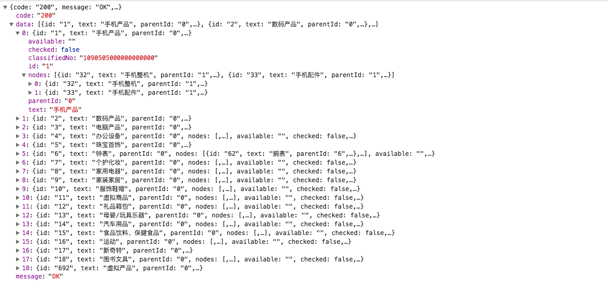
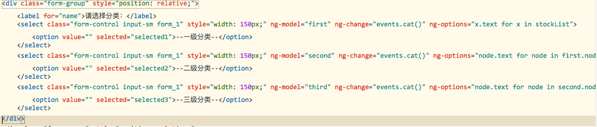
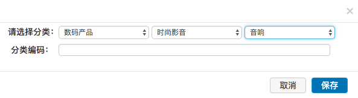
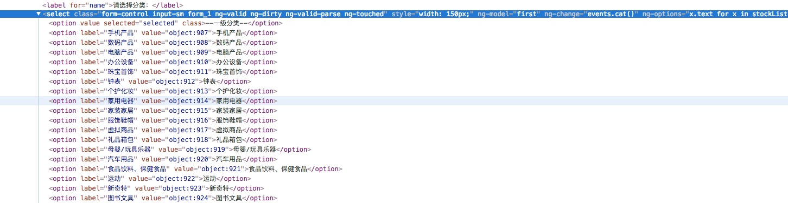

身为一个后端开发，也难免要搞点前端的事情。

最近在开发一个小功能的时候发现需要页面实现三级联动，由于前端用的是angular所以被迫了解了一下。

不得不承认，angularjs还是比较容易上手，里面很多地方都让人不禁感叹，牛逼！牛逼！

由于我只是记录学习过程中用到的东西，并不打算做什么教程，所以闲话就少说了，直接来干货。

### **ng-select**
由于之前已经有类似借口可以给我提供数据，返回的数据接口如
因为我认为返回数据格式完全可以支持三级联动，于是我上网查了下anglar如何实现三级联动(这里不放链接了，一搜一大把)。
然后我发现了ng-select。

ng-select用来将数据同HTML的< select>进行绑定。这个指令可以和ng-model以及ng-options指令一起使用，构建精细且表现良好的动态表单。

ng-options的值可以是一个内涵表达式（comprehension expression），其实这只是一种有趣的说法，简单来说就是它可以接收一个数组或者对象，并对她们进行循环，将内部的内容提供给select标签内部的选项。ng-options有以下格式的语法

for array data sources:

label for value in array
> select as label for value in array

> label group by group for value in array

> select as label group by group for value in array track by trackexpr

for object data sources:

> label for (key , value) in object

> select as label for (key , value) in object

> label group by group for (key, value) in object

> select as label group by group for (key, value) in ob

经过一小会er的思考，我将页面代码写成
然后惊喜的发现已经成功了，在感叹angular强大的同时也默默自满了一下。在页面上的效果是这样的

然后查看一下dom

会发现，上面的option中的text都是对象，这也很容易理解，因为stockList数组的每一项都是一个对象，绑定的时候将以对象直接绑定上。那么我们如何只让它显示text属性呢？

angular告诉我们，直接点出属性即可：`node.text for node in first.nodes`

接下来就涉及到双向绑定。这里已经指定了ng-model，获取选中的值，也非常方便了。由于代码是我修改完发出来的，所以上文中可以查看代码图片，就不过多解释了。

之后在js中用angular.copy将object返显出来，我就达到目的啦。

###-----------------------------------------------------

总结一下。三级联动的实现主要靠函数表达式来实现，但这种表达式反选会出现问题，导致数据不能返显，所以要依靠ng-change记录表单变化来实现返显。

